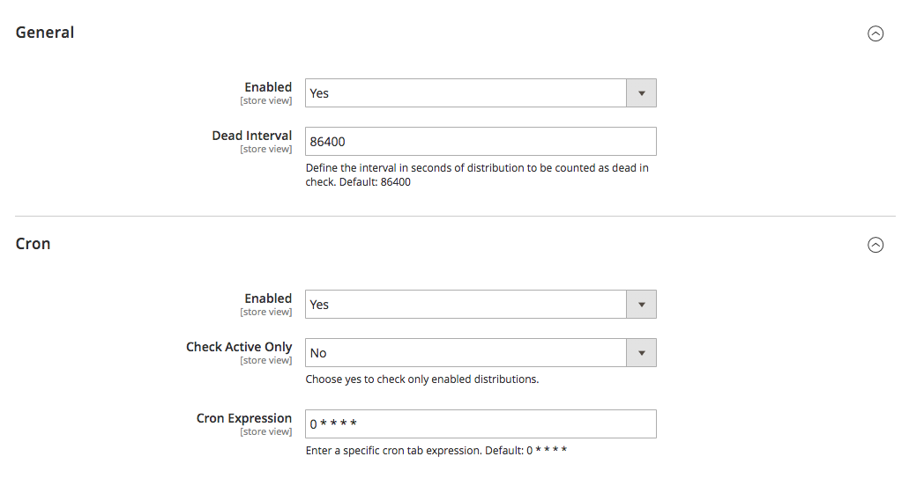
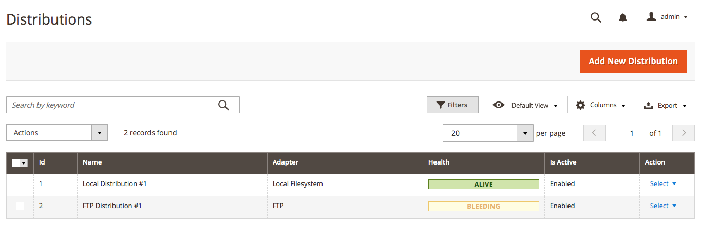
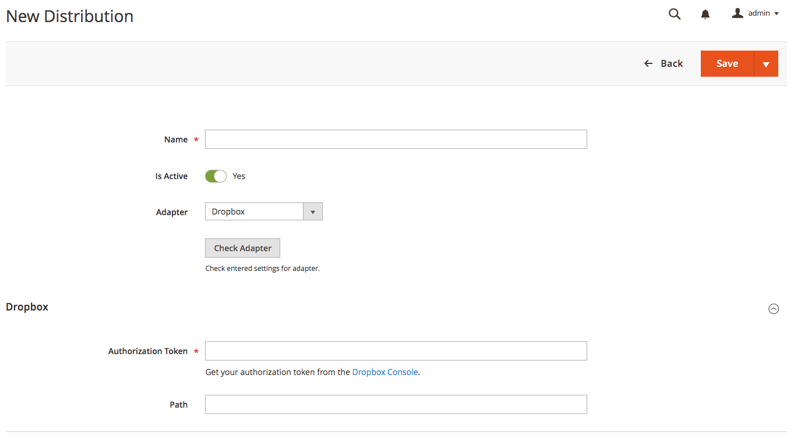

# Magento 2 -  Distribution Module

With this module you will be able to manage your distribution destinations.

All distribution adapters are build on top of the adapters of [thephpleague/flysystem](https://github.com/thephpleague/flysystem). With that power any developer could write his own distribution adapters with a little bit of customization code on top of any adapter for Flysystem. 

So you will be able to use the distributions to copy, delete, move or rename files on remote destination if the adapter supports that operations.

## Build-In Adapters

- Aws S3
- Cloudinary
- Dropbox
- FTP
- Google Cloud Storage
- Google Drive
- Local
- OneDrive
- Selectel
- SFTP

## Available Languages

- English (US)
- German

## Requirements

- Magento 2.3.0
- FjodorMaller_Base 1.0.0

## Installation

### Manual

1) Unpack the ZIP archive file to the `app/code/FjodorMaller/` directory of your magento instance.
2) Run command `php bin/magento module:enable FjodorMaller_Distribution` to enable the module.
3) Run command `php bin/magento setup:upgrade` to upgrade the database.
4) Run command `php bin/magento setup:di:compile` to generate classes on your instance. 

### Composer

1) Run command `require maller86/module-distribution` to add requirement to your composer.json file.
2) Run command `php bin/magento setup:upgrade` to upgrade the database.
3) Run command `php bin/magento setup:di:compile` to generate classes on your instance.

## Configuration

Go to **Stores > Configuration > Fjodor Maller Modules > Distributions**

## Managing Distributions

Go To **System > Fjodor Maller Modules > Distributions**

### Creating New Distribution

## Usage

This module can be used by end users for managing the distributions only. Further processing should be done by a Magento 2 developer.

To use a distribution you should use Dependency Injection to inject the interface `FjodorMaller\Distribution\Api\DistributionServiceInterface` to your model. Within this interface you have the method `getFilesystemByDistributionId($distributionId)` with the distribution id as the only parameter.

When the given distribution id was found, it will return an instance implementing `League\Flysystem\FilesystemInterface` that is ready to use with the mentioned operations above.  

## License

MIT License

Copyright (c) 2019 Fjodor Maller

Permission is hereby granted, free of charge, to any person obtaining a copy of this software and associated documentation files (the "Software"), to deal in the Software without restriction, including without limitation the rights to use, copy, modify, merge, publish, distribute, sublicense, and/or sell copies of the Software, and to permit persons to whom the Software is furnished to do so, subject to the following conditions:

The above copyright notice and this permission notice shall be included in all copies or substantial portions of the Software.

THE SOFTWARE IS PROVIDED "AS IS", WITHOUT WARRANTY OF ANY KIND, EXPRESS OR IMPLIED, INCLUDING BUT NOT LIMITED TO THE WARRANTIES OF MERCHANTABILITY, FITNESS FOR A PARTICULAR PURPOSE AND NONINFRINGEMENT. IN NO EVENT SHALL THE AUTHORS OR COPYRIGHT HOLDERS BE LIABLE FOR ANY CLAIM, DAMAGES OR OTHER LIABILITY, WHETHER IN AN ACTION OF CONTRACT, TORT OR OTHERWISE, ARISING FROM, OUT OF OR IN CONNECTION WITH THE SOFTWARE OR THE USE OR OTHER DEALINGS IN THE SOFTWARE.
